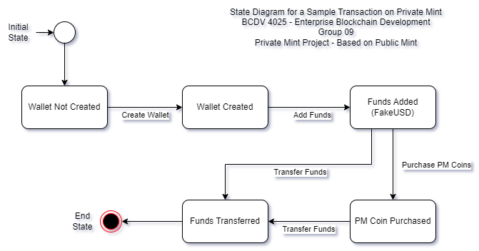
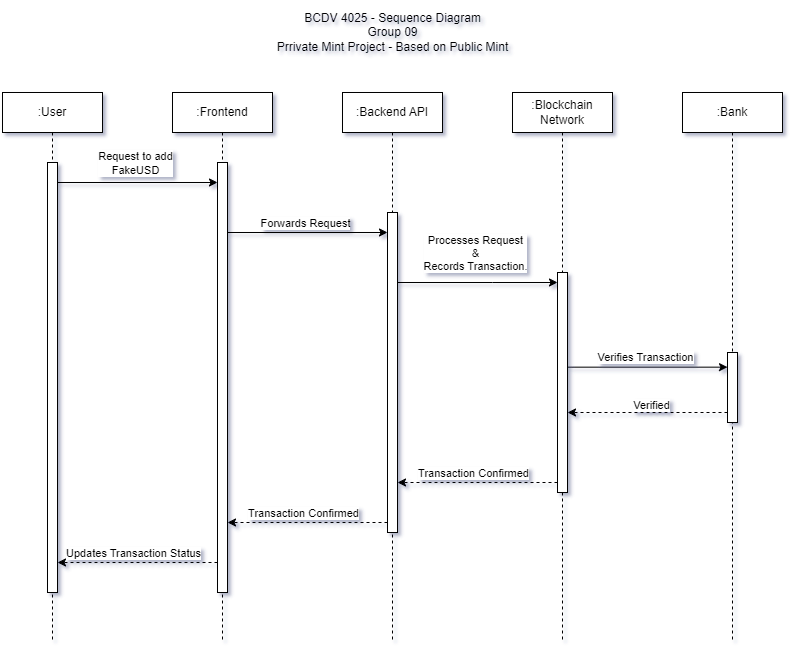

# Private Mint Project - Based on Public Mint

<https://publicmint.com/>

## BCDV 4025 - Enterprise Blockchain Development - George Brown College - Group 09

## Table of Contents

- [Private Mint Project - Based on Public Mint](#private-mint-project---based-on-public-mint)
  - [BCDV 4025 - Enterprise Blockchain Development - George Brown College - Group 09](#bcdv-4025---enterprise-blockchain-development---george-brown-college---group-09)
  - [Table of Contents](#table-of-contents)
  - [Team](#team)
  - [Project Description and Insights](#project-description-and-insights)
    - [Benefits](#benefits)
    - [Tradeoffs](#tradeoffs)
  - [Roles and Policies](#roles-and-policies)
    - [Roles](#roles)
    - [Policies](#policies)
  - [Project Roadmap](#project-roadmap)
    - [Phase 1: Core Blockchain and Application Setup](#phase-1-core-blockchain-and-application-setup)
    - [Phase 2: Advanced Features and Integrations](#phase-2-advanced-features-and-integrations)
    - [Phase 3: Market Integration and Real-time Data](#phase-3-market-integration-and-real-time-data)
    - [Phase 4: Scaling and Optimization](#phase-4-scaling-and-optimization)
    - [Phase 5: Additional Financial Services](#phase-5-additional-financial-services)
    - [Ongoing: Security, Compliance, and User Feedback](#ongoing-security-compliance-and-user-feedback)
  - [Requirements](#requirements)
  - [State Diagram](#state-diagram)
  - [Sequence Diagram](#sequence-diagram)
  - [Git Repositories for the Project](#git-repositories-for-the-project)
  - [Commands to make it all work](#commands-to-make-it-all-work)
    - [Terminal 1](#terminal-1)
    - [ORG1 Terminal - Terminal 2](#org1-terminal---terminal-2)
    - [ORG2 Terminal - Terminal 3](#org2-terminal---terminal-3)
    - [Do in both OTHER Terminals (2 and 3)](#do-in-both-other-terminals-2-and-3)
    - [Back to ORG1 - Terminal 2](#back-to-org1---terminal-2)
    - [Backend Terminal - Terminal 4](#backend-terminal---terminal-4)
    - [Server-Backend/API - Terminal 5](#server-backendapi---terminal-5)
    - [Back to Backend Terminal - Terminal 4](#back-to-backend-terminal---terminal-4)
    - [Frontend Terminal - Terminal 6](#frontend-terminal---terminal-6)
  - [Results](#results)
  - [License](#license)
  - [Notes](#notes)

## Team

- 101504708 - Anishkumar Pankajkumar Patel - Full Stack Developer & Blockchain Developer
- 101492108 - Xiaogang Dong - Business Analyst & Frontend Developer
- 101483544 - Angel Ordonez - Architect & Backend Developer

## Project Description and Insights

The "Private Mint" project is a pioneering digital currency platform developed on the Hyperledger Fabric blockchain. It empowers users with the ability to manage virtual wallets, conduct transactions using a simulated currency called FakeUSD, and invest in an innovative digital asset, PM Coin. This platform demonstrates the potential for secure, transparent, and efficient digital currency management in a permissioned ledger environment.

**Insights:**

Our project showcases the significant advantages of blockchain technology for digital finance, including enhanced security, user empowerment, and operational scalability. By simulating real-world financial transactions, "Private Mint" provides valuable insights into the integration of blockchain technology with traditional financial systems, highlighting both the potential and the challenges of such endeavors.

### Benefits

- **Security and Transparency:** Leveraging blockchain technology ensures that all transactions are secure, transparent, and immutable.
- **User Empowerment:** Users have full control over their virtual wallets, promoting a sense of ownership and privacy.
- **Scalability:** The permissioned blockchain model allows for scalable and efficient management of digital currencies.

### Tradeoffs

- **Complexity in Adoption:** The integration of blockchain into real-world applications presents a learning curve and adoption barrier for traditional financial institutions.
- **Resource Intensity:** Running and maintaining a blockchain network requires significant computational resources and expertise.

## Roles and Policies

### Roles

- **Org1 (Private Mint):** Manages PM Coin and FakeUSD issuance.
- **Org2 (Bank):** Authorizes FakeUSD transactions.
- **Users:** Engage with the platform for transactions and balance checks.

### Policies

- **Security Measures:** Implement robust security protocols to protect user transactions and data.
- **Data Privacy:** Adhere to strict data privacy standards, ensuring user data is handled confidentially.
- **Dispute Resolution:** Establish clear procedures for resolving disputes and handling fraudulent activities.

## Project Roadmap

### Phase 1: Core Blockchain and Application Setup

- **Setup Hyperledger Fabric Network:** Configure the network with Org1 (Private Mint) and Org2 (Bank).
- **Develop Initial Smart Contracts:** Create chaincode for user wallet management, FakeUSD transactions, and PM Coin purchasing.
- **API and Frontend Development:** Build APIs and a basic frontend for user signup/login, balance display, and transactions.
- **Bank Integration for FakeUSD:** Implement the functionality for Org2 to authorize FakeUSD addition to wallets.

### Phase 2: Advanced Features and Integrations

- **Dynamic PM Coin Exchange Rate:** Develop functionality to adjust PM Coin's exchange rate based on predefined criteria or integrate with a mock external pricing source.
- **Enhanced User Wallet Features:** Add options for users to view transaction history, receive notifications for balance changes, and implement security features like 2FA.

### Phase 3: Market Integration and Real-time Data

- **Live Market Price Integration:** Implement live market price feeds for PM Coin to adjust the exchange rate dynamically.
- **Advanced Trading Features:** Offer users the ability to set buy/sell orders based on specific price points or market conditions.

### Phase 4: Scaling and Optimization

- **Performance Optimization:** Analyze system performance and optimize chaincode, API responses, and frontend loading times.
- **Scalability Enhancements:** Ensure the system can handle increased user loads and transaction volumes, possibly by adding more peers to the network or optimizing chaincode execution.

### Phase 5: Additional Financial Services

- **Extended Financial Products:** Explore adding other financial services like staking, lending, or yield farming mechanisms using FakeUSD and PM Coin.
- **Partnerships and External Integrations:** Establish partnerships with real banks or financial institutions for direct fiat conversions and other banking services.

### Ongoing: Security, Compliance, and User Feedback

- **Security Audits and Compliance Checks:** Regularly audit the system for security vulnerabilities and ensure compliance with relevant financial regulations.
- **User Feedback Loop:** Implement a feedback system to collect user suggestions and concerns, using this input to guide future developments and improvements.

This roadmap lays out a comprehensive path from initial development to advanced features, focusing on user engagement, market integration, and scalability. It's adaptable based on project progress, user needs, and technological advancements.

## Requirements

- Docker and Docker Compose
- Node.js (Version 18.0.0)
- Hyperledger Fabric 2.x
- React for frontend development

## State Diagram

## Sequence Diagram

## Git Repositories for the Project

- [Private Mint Network](https://github.com/apatel2582/private-mint-network) - [https://github.com/apatel2582/private-mint-network](https://github.com/apatel2582/private-mint-network) - Network Files for Private Mint
- [Private Mint API](https://github.com/apatel2582/private-mint-api) - [https://github.com/apatel2582/private-mint-api](https://github.com/apatel2582/private-mint-api) - Backend API for Private Mint
- [Private Mint Frontend](https://github.com/apatel2582/private-mint-frontend) - [https://github.com/apatel2582/private-mint-frontend](https://github.com/apatel2582/private-mint-frontend) - Frontend for Private Mint

## Commands to make it all work

### Terminal 1

`sudo apt update`

`sudo apt -y upgrade`

`sudo apt install curl`

`sudo apt install git`

`sudo apt update`

`sudo apt upgrade`

`sudo apt install apt-transport-https ca-certificates gnupg-agent software-properties-common`

`curl -fsSL https://download.docker.com/linux/ubuntu/gpg | sudo apt-key add -`

`sudo add-apt-repository "deb [arch=amd64] https://download.docker.com/linux/ubuntu $(lsb_release -cs) stable"`

`sudo apt update`

`sudo apt -y install docker-ce`

`sudo usermod -aG docker <username>`

`` sudo curl -L https://github.com/docker/compose/releases/download/1.27.4/docker-compose-`uname -s`-`uname -m` -o /usr/local/bin/docker-compose ``

`sudo chmod +x /usr/local/bin/docker-compose`

`git clone https://github.com/hyperledger/fabric-samples.git`

`cd fabric-samples`

`curl -sSL https://raw.githubusercontent.com/hyperledger/fabric/main/scripts/bootstrap.sh > bootstrap.sh`

`chmod u+x bootstrap.sh`

`sudo ./bootstrap.sh`

`cd test-network`

`sudo ./network.sh down`

`sudo ./network.sh up createChannel -ca -s couchdb`

`cd ..`

`curl -o- https://raw.githubusercontent.com/nvm-sh/nvm/v0.39.7/install.sh | bash`

`source ~/.bashrc`

`nvm install 18.0.0`

`git clone https://github.com/apatel2582/private-mint-network.git`

`cd private-mint-network/`

`npm install`

### ORG1 Terminal - Terminal 2

`cd ~`
`cd fabric-samples/test-network`
`export CORE_PEER_TLS_ENABLED=true`
`export CORE_PEER_LOCALMSPID="Org1MSP"`
`export CORE_PEER_TLS_ROOTCERT_FILE=${PWD}/organizations/peerOrganizations/org1.example.com/peers/peer0.org1.example.com/tls/ca.crt`
`export CORE_PEER_MSPCONFIGPATH=${PWD}/organizations/peerOrganizations/org1.example.com/users/Admin@org1.example.com/msp`
`export CORE_PEER_ADDRESS=localhost:7051`
`export PATH=${PWD}/../bin:$PATH`
`export FABRIC_CFG_PATH=$PWD/../config/`
`sudo chmod a+rwx -R organizations`  
`sudo chmod a+rwx -R ../config`  
`peer channel list`

### ORG2 Terminal - Terminal 3

`cd ~`
`cd fabric-samples/test-network`
`export CORE_PEER_TLS_ENABLED=true`
`export CORE_PEER_LOCALMSPID="Org2MSP"`
`export CORE_PEER_TLS_ROOTCERT_FILE=${PWD}/organizations/peerOrganizations/org2.example.com/peers/peer0.org2.example.com/tls/ca.crt`
`export CORE_PEER_MSPCONFIGPATH=${PWD}/organizations/peerOrganizations/org2.example.com/users/Admin@org2.example.com/msp`
`export CORE_PEER_ADDRESS=localhost:9051`
`export PATH=${PWD}/../bin:$PATH`
`export FABRIC_CFG_PATH=$PWD/../config/`
`peer channel list`

### Do in both OTHER Terminals (2 and 3)

`peer lifecycle chaincode package private-mint-network.tar.gz --path ../private-mint-network --lang node --label private-mint-network_1.0`

`peer lifecycle chaincode install private-mint-network.tar.gz`

-> this will change depending on the output of the previous command
`export PACKAGE_ID=private-mint-network_1.0:a33e5169c6b0b5b4d7b99d5eebfd9ca58dde77a27767edc5eed38cd6d32919a9`

`peer lifecycle chaincode queryinstalled`

`peer lifecycle chaincode approveformyorg -o localhost:7050 --ordererTLSHostnameOverride orderer.example.com --channelID mychannel --name private-mint-network --version 1.0 --package-id $PACKAGE_ID --sequence 1 --tls --cafile ${PWD}/organizations/ordererOrganizations/example.com/orderers/orderer.example.com/msp/tlscacerts/tlsca.example.com-cert.pem`

`peer lifecycle chaincode checkcommitreadiness --channelID mychannel --name private-mint-network --version 1.0 --sequence 1 --tls --cafile ${PWD}/organizations/ordererOrganizations/example.com/orderers/orderer.example.com/msp/tlscacerts/tlsca.example.com-cert.pem --output json`

### Back to ORG1 - Terminal 2

`peer lifecycle chaincode commit -o localhost:7050 --ordererTLSHostnameOverride orderer.example.com --channelID mychannel --name private-mint-network --version 1.0 --sequence 1 --tls --cafile ${PWD}/organizations/ordererOrganizations/example.com/orderers/orderer.example.com/msp/tlscacerts/tlsca.example.com-cert.pem --peerAddresses localhost:7051 --tlsRootCertFiles ${PWD}/organizations/peerOrganizations/org1.example.com/peers/peer0.org1.example.com/tls/ca.crt --peerAddresses localhost:9051 --tlsRootCertFiles ${PWD}/organizations/peerOrganizations/org2.example.com/peers/peer0.org2.example.com/tls/ca.crt`

`peer lifecycle chaincode querycommitted --channelID mychannel --name private-mint-network --cafile ${PWD}/organizations/ordererOrganizations/example.com/orderers/orderer.example.com/msp/tlscacerts/tlsca.example.com-cert.pem`

`peer chaincode invoke -o localhost:7050 --ordererTLSHostnameOverride orderer.example.com --tls --cafile ${PWD}/organizations/ordererOrganizations/example.com/orderers/orderer.example.com/msp/tlscacerts/tlsca.example.com-cert.pem -C mychannel -n private-mint-network --peerAddresses localhost:7051 --tlsRootCertFiles ${PWD}/organizations/peerOrganizations/org1.example.com/peers/peer0.org1.example.com/tls/ca.crt --peerAddresses localhost:9051 --tlsRootCertFiles ${PWD}/organizations/peerOrganizations/org2.example.com/peers/peer0.org2.example.com/tls/ca.crt -c '{"function":"upsertWallet","Args":["user1"]}'`

`peer chaincode query -C mychannel -n private-mint-network -c '{"function":"getWallet","Args":["user1"]}'`

`peer chaincode invoke -o localhost:7050 --ordererTLSHostnameOverride orderer.example.com --tls --cafile ${PWD}/organizations/ordererOrganizations/example.com/orderers/orderer.example.com/msp/tlscacerts/tlsca.example.com-cert.pem -C mychannel -n private-mint-network --peerAddresses localhost:7051 --tlsRootCertFiles ${PWD}/organizations/peerOrganizations/org1.example.com/peers/peer0.org1.example.com/tls/ca.crt --peerAddresses localhost:9051 --tlsRootCertFiles ${PWD}/organizations/peerOrganizations/org2.example.com/peers/peer0.org2.example.com/tls/ca.crt -c '{"function":"cheatAddFakeUSD","Args":["user1", "100"]}'`

`peer chaincode invoke -o localhost:7050 --ordererTLSHostnameOverride orderer.example.com --tls --cafile ${PWD}/organizations/ordererOrganizations/example.com/orderers/orderer.example.com/msp/tlscacerts/tlsca.example.com-cert.pem -C mychannel -n private-mint-network --peerAddresses localhost:7051 --tlsRootCertFiles ${PWD}/organizations/peerOrganizations/org1.example.com/peers/peer0.org1.example.com/tls/ca.crt --peerAddresses localhost:9051 --tlsRootCertFiles ${PWD}/organizations/peerOrganizations/org2.example.com/peers/peer0.org2.example.com/tls/ca.crt -c '{"function":"upsertWallet","Args":["user2"]}'`

`peer chaincode query -C mychannel -n private-mint-network -c '{"function":"getWallet","Args":["user2"]}'`

`peer chaincode invoke -o localhost:7050 --ordererTLSHostnameOverride orderer.example.com --tls --cafile ${PWD}/organizations/ordererOrganizations/example.com/orderers/orderer.example.com/msp/tlscacerts/tlsca.example.com-cert.pem -C mychannel -n private-mint-network --peerAddresses localhost:7051 --tlsRootCertFiles ${PWD}/organizations/peerOrganizations/org1.example.com/peers/peer0.org1.example.com/tls/ca.crt --peerAddresses localhost:9051 --tlsRootCertFiles ${PWD}/organizations/peerOrganizations/org2.example.com/peers/peer0.org2.example.com/tls/ca.crt -c '{"function":"cheatAddFakeUSD","Args":["user2", "100000"]}'`

`peer chaincode invoke -o localhost:7050 --ordererTLSHostnameOverride orderer.example.com --tls --cafile ${PWD}/organizations/ordererOrganizations/example.com/orderers/orderer.example.com/msp/tlscacerts/tlsca.example.com-cert.pem -C mychannel -n private-mint-network --peerAddresses localhost:7051 --tlsRootCertFiles ${PWD}/organizations/peerOrganizations/org1.example.com/peers/peer0.org1.example.com/tls/ca.crt --peerAddresses localhost:9051 --tlsRootCertFiles ${PWD}/organizations/peerOrganizations/org2.example.com/peers/peer0.org2.example.com/tls/ca.crt -c '{"function":"transferFakeUSD","Args":["user2", "user1", "1000"]}'`

`peer chaincode invoke -o localhost:7050 --ordererTLSHostnameOverride orderer.example.com --tls --cafile ${PWD}/organizations/ordererOrganizations/example.com/orderers/orderer.example.com/msp/tlscacerts/tlsca.example.com-cert.pem -C mychannel -n private-mint-network --peerAddresses localhost:7051 --tlsRootCertFiles ${PWD}/organizations/peerOrganizations/org1.example.com/peers/peer0.org1.example.com/tls/ca.crt --peerAddresses localhost:9051 --tlsRootCertFiles ${PWD}/organizations/peerOrganizations/org2.example.com/peers/peer0.org2.example.com/tls/ca.crt -c '{"function":"purchasePMCoin","Args":["user1", "10"]}'`

### Backend Terminal - Terminal 4

`cd ~`
`git clone https://github.com/apatel2582/private-mint-api.git`
`cd private-mint-api/`
`npm install`
`node enrollUser.js 'CAAdmin@org1.example.com' admin adminpw`
`node registerUser.js 'CAAdmin@org1.example.com' 'User1@org1.example.com' '{"secret": "userpw"}'`
`node enrollUser.js 'User1@org1.example.com' 'User1@org1.example.com' userpw`

### Server-Backend/API - Terminal 5

`cd private-mint-api/`
`node app.js`

### Back to Backend Terminal - Terminal 4

curl -X POST http://localhost:3001/api/upsertWallet \
-H "Content-Type: application/json" \
-d '{"userId": "user2"}'

curl -X POST http://localhost:3001/api/upsertWallet \
-H "Content-Type: application/json" \
-d '{"userId": "user3"}'

`curl http://localhost:3001/api/getWallet/user2`

curl -X POST http://localhost:3001/api/cheatAddFakeUSD \
-H "Content-Type: application/json" \
-d '{"userId": "user2", "amount": "1000"}'

`curl http://localhost:3001/api/getWallet/user2`

curl -X POST http://localhost:3001/api/transferFakeUSD \
-H "Content-Type: application/json" \
-d '{"fromUserId": "user2", "toUserId": "user3", "amount": "500"}'

`curl http://localhost:3001/api/getWallet/user3`

curl -X POST http://localhost:3001/api/purchasePMCoin \
-H "Content-Type: application/json" \
-d '{"userId": "user2", "pmCoinAmount": "10"}'

`curl http://localhost:3001/api/getWallet/user2`

### Frontend Terminal - Terminal 6

`cd ~`
`git clone https://github.com/apatel2582/private-mint-frontend.git`
`cd private-mint-frontend/`
`npm install`
`npm start`

## Results

The application successfully demonstrates the creation and management of digital wallets, secure transactions using smart contracts, and the dynamic interaction between users and the blockchain network. Our testing phase showed a robust and user-friendly platform, ready for further development and real-world application.

## License

This project is released under an open-source license, permitting free use, modification, and distribution of the software in accordance with the terms of this license.

## Notes

- This is a Project for the course BCDV 4025 - Enterprise Blockchain Development at George Brown College, Toronto, ON, Canada.
- The project is developed by Anishkumar Pankajkumar Patel, Xiaogang Dong, and Angel Ordonez.
- The project is developed using Hyperledger Fabric, Node.js, and React.
- The project is developed as a part of the course curriculum and is not intended for commercial use.
- The project is developed for educational purposes and to showcase the potential of blockchain technology in the financial sector.
- The project is developed to demonstrate the capabilities of blockchain technology in a permissioned ledger environment.
